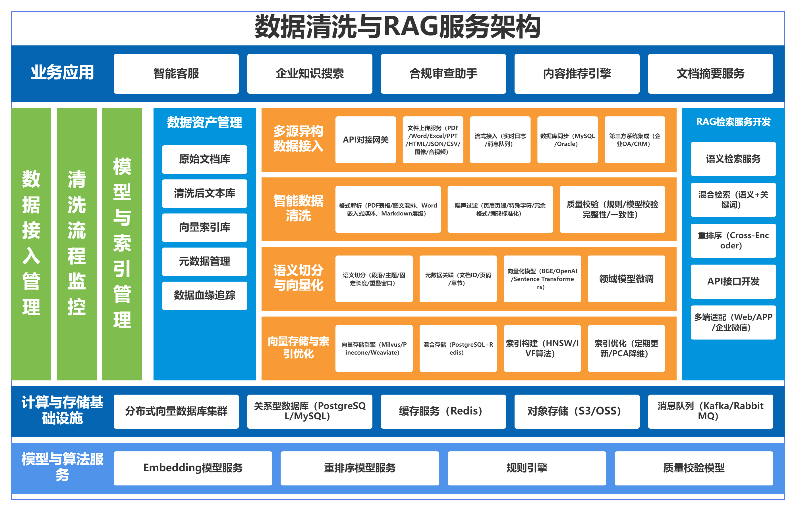

# 数据清洗与 RAG 服务架构设计

## 背景与目标

本设计基于 `docs/codex/v1/requirements/data-cleaning-rag-architecture-requirements.md`，围绕企业知识数据从接入、清洗、资产沉淀、向量化到 RAG 检索服务的完整链路进行设计。

设计目标是先形成可落地的 v1 平台骨架，再允许后续按接入源、清洗能力、模型能力和检索能力逐步增强。

总体架构图已沉淀到：

- 原图：`docs/codex/v1/assets/总体架构图.png`
- 可编辑 HTML 版：`docs/codex/v1/assets/data-cleaning-rag-overall-architecture.html`

## 总体架构

系统划分为 8 个核心层：

1. 业务应用层：智能客服、企业知识搜索、合规审查助手、内容推荐、文档摘要。
2. 接入层：API 网关、文件上传、流式接入、数据库同步、第三方系统集成。
3. 清洗编排层：任务调度、格式解析、噪声过滤、质量校验、失败重试。
4. 语义处理层：文本切分、元数据关联、Embedding 生成、领域模型扩展。
5. 存储与索引层：对象存储、关系库、缓存、向量库、关键词索引。
6. RAG 服务层：语义检索、关键词检索、混合召回、粗排、业务干预、精排、API 输出。
7. 模型与算法层：Embedding 模型、重排模型、规则引擎、质量校验模型。
8. 治理与运维层：数据资产管理、流程监控、模型与索引管理、血缘追踪。

## 技术选型建议

### 后端服务

推荐：统一使用 Python 技术栈，控制面采用 FastAPI，异步处理采用 Python Worker。

- FastAPI 负责 API 网关、任务管理、元数据管理、状态查询和检索入口。
- Python Worker 负责文档解析、清洗、切分、Embedding、向量写入等异步重任务。
- API 服务与 Worker 通过 MQ 解耦，保持任务可重试、可扩展、可观测。

本项目名为“清洗服务”，清洗、模型和向量化链路占比较高，因此统一 Python 能减少跨语言集成成本。仍保留“控制面 + Worker”的架构边界：API/任务/资产管理一个服务，清洗与向量化 Worker 可横向扩展。

### 数据库与存储

推荐组合：

- 关系型数据库：PostgreSQL 优先，MySQL 可作为企业兼容备选。
- 对象存储：MinIO/S3/OSS，用于原始文件、解析中间产物和导出结果。
- 缓存：Redis，用于任务短状态、热点配置、检索缓存和分布式锁。
- 消息队列：Kafka 适合高吞吐日志/流式场景，RabbitMQ 适合任务型工作队列；MVP 可先用 RabbitMQ，后续高吞吐再引入 Kafka。

### 向量数据库

推荐：Milvus 或 Qdrant；若希望快速 MVP 且数据量较小，可使用 PostgreSQL + pgvector。

- Milvus：适合大规模向量、索引策略丰富、独立向量基础设施。
- Qdrant：部署和过滤体验较轻，适合中小规模私有化场景。
- pgvector：架构简单，适合 MVP 或低规模场景，但大规模索引与运维能力有限。
- Pinecone/Weaviate：适合云服务或特定生态，但需要结合私有化、安全和成本要求确认。

### 文档解析与清洗

推荐：

- PDF/Office/HTML/CSV/JSON：采用解析器插件化接口，具体实现按格式引入成熟库。
- OCR：作为独立能力接入，避免阻塞 v1 主链路。
- 清洗规则：规则引擎 + 可配置清洗策略，先覆盖页眉页脚、重复段落、特殊字符和格式标准化。
- 质量校验：规则校验优先，模型校验作为增强。

### 检索与排序

推荐：

- 关键词检索：Elasticsearch/OpenSearch 或关系库全文索引，MVP 可根据已有基础设施选择。
- 语义检索：向量库 TopK。
- 混合检索：关键词召回 + 向量召回合并，按归一化分数和业务权重融合。
- 粗排：双塔/DSSM/FM/DNN 或向量内积，先将大候选集压缩到千级。
- 业务干预：SimHash/MinHash 去重，MMR/DPP 打散，叠加权限、时效和质量规则。
- 精排：Cross-Encoder 模型服务，仅处理约 50 到 100 个候选，支持超时降级。

### 模型服务

推荐：

- Embedding 服务抽象为统一兼容接口，MVP 支持线上通义 text-embedding、本地 BGE 和 mock embedding 兜底。通过 `EMBEDDING_PROVIDER`、`EMBEDDING_MODEL`、`EMBEDDING_DIMENSION`、`DASHSCOPE_API_KEY`、`EMBEDDING_BASE_URL` 切换实现。
- 粗排模型和重排模型独立部署或以插件方式接入，检索链路设置超时、降级和熔断。
- 质量校验模型先预留接口，v1 以规则校验为主。

## 核心模块设计

### 1. 接入管理模块

职责：

- 统一创建接入任务。
- 管理数据源、文档、版本、文件对象地址和任务状态。
- 提供上传、批量导入、任务查询和重试入口。

输入：

- 文件、URL、API payload、数据库同步配置、第三方系统回调。

输出：

- `ingestion_job`、`document`、`document_version`、对象存储地址。

边界：

- 不直接执行复杂解析，只负责接入元信息和任务投递。

### 2. 清洗流水线模块

职责：

- 按阶段执行解析、结构提取、噪声过滤、标准化、质量校验。
- 记录每个阶段的输入输出摘要、耗时和错误。
- 支持幂等重试和失败补偿。

核心阶段：

1. Parse：解析文件内容。
2. Normalize：统一编码、格式和结构字段。
3. Clean：过滤噪声和重复内容。
4. Validate：质量校验。
5. Persist：写入清洗文本库。

### 3. 语义切分与向量化模块

职责：

- 根据文档结构和策略生成 chunk。
- 关联文档、页码、章节、版本、权限等元数据。
- 调用 Embedding 服务生成向量。
- 将向量和元数据写入向量库。

切分策略：

- 标题/章节优先。
- 长段落按 token 或字符长度切分。
- 支持 overlap，避免上下文断裂。
- 表格、代码块和列表可作为特殊块处理。

### 4. RAG 检索服务模块

职责：

- 提供统一检索 API。
- 支持语义检索、关键词检索、混合召回、粗排、业务干预和精排。
- 返回可追溯结果，包含来源、片段、分数和元数据。

检索流程：

1. Query Normalize：查询标准化、权限上下文解析。
2. Recall：执行关键词召回和向量召回。
3. Merge：合并多路召回结果，保留召回来源和原始分数。
4. Pre-rank：使用双塔/DSSM/FM/DNN 或向量内积进行粗排，将万级或十万级候选压缩到约 1000。
5. Business Rules：使用 SimHash/MinHash 去重，使用 MMR/DPP 打散，并应用权限、时效、质量等业务规则。
6. Rerank：仅对约 50 到 100 个候选调用 Cross-Encoder 等精排模型。
7. Return：返回片段、来源、分数和追溯信息。

### 5. 数据资产管理模块

职责：

- 管理原始文档、清洗文本、文本块、向量索引、任务状态、血缘关系。
- 支持文档版本、索引版本和任务版本关联。
- 为审计、重建和问题定位提供查询能力。

### 6. 治理与监控模块

职责：

- 监控清洗任务、模型调用、索引构建、检索耗时和失败率。
- 支持任务重试、暂停、跳过、重建索引。
- 管理清洗规则、切分策略、模型配置和索引策略。

## 关键数据对象

### data_source

- `id`
- `name`
- `type`
- `owner`
- `tenant_id`
- `config_ref`
- `status`

### document

- `id`
- `source_id`
- `title`
- `content_type`
- `tenant_id`
- `permission_tags`
- `current_version_id`
- `status`

### document_version

- `id`
- `document_id`
- `version_no`
- `object_uri`
- `checksum`
- `parse_status`
- `clean_status`
- `index_status`
- `created_at`

### cleaning_job

- `id`
- `document_version_id`
- `job_type`
- `status`
- `current_stage`
- `retry_count`
- `error_code`
- `error_message`
- `started_at`
- `finished_at`

### text_chunk

- `id`
- `document_id`
- `document_version_id`
- `chunk_no`
- `content`
- `metadata`
- `token_count`
- `checksum`
- `status`

### vector_record

- `id`
- `chunk_id`
- `embedding_model`
- `vector_store`
- `collection`
- `vector_id`
- `index_version`
- `status`

## 状态流转

文档版本状态：

`UPLOADED -> PARSING -> PARSED -> CLEANING -> CLEANED -> CHUNKING -> EMBEDDING -> INDEXED`

失败状态：

`PARSE_FAILED`、`CLEAN_FAILED`、`VALIDATE_FAILED`、`EMBED_FAILED`、`INDEX_FAILED`

重试规则：

- 同一阶段失败可重试。
- 重试时使用 `document_version_id + stage + checksum` 保证幂等。
- 已成功写入的 chunk 和 vector 需要支持覆盖、逻辑删除或版本替换。

## 接口设计草案

### 创建文件接入任务

`POST /api/v1/ingestions/files`

请求要点：

- 文件或对象存储地址。
- 数据源、知识库、租户、权限标签。
- 清洗策略、切分策略、索引策略。

返回要点：

- `job_id`
- `document_id`
- `document_version_id`
- `status`

### 查询任务状态

`GET /api/v1/jobs/{job_id}`

返回要点：

- 当前阶段。
- 状态。
- 错误原因。
- 阶段耗时。
- 可重试标识。

### 发起检索

`POST /api/v1/rag/search`

请求要点：

- `query`
- `knowledge_base_ids`
- `tenant_id`
- `permission_context`
- `search_mode`: semantic、keyword、hybrid
- `top_k`
- `recall_size`
- `pre_rank_size`
- `rerank_size`
- `rerank_enabled`

返回要点：

- `items[].content`
- `items[].document_id`
- `items[].chunk_id`
- `items[].source`
- `items[].score`
- `items[].recall_source`
- `items[].pre_rank_score`
- `items[].rerank_score`
- `items[].metadata`

## 幂等与一致性

- 文件接入以文件 checksum、数据源、版本号识别重复提交。
- 清洗阶段输出以 `document_version_id + stage + output_checksum` 记录。
- 向量写入以 `chunk_id + embedding_model + index_version` 保证可重建。
- 删除或更新文档时优先写入新版本，检索侧按可见版本过滤，避免半更新状态暴露。

## 安全与权限

- API 网关负责鉴权、租户识别和限流。
- 文档、chunk、vector 元数据都保留租户和权限标签。
- 检索时必须携带权限上下文，并在关键词检索和向量过滤中同时生效。
- 敏感数据脱敏可作为清洗规则插件接入。

## 可观测性

核心指标：

- 接入任务数、成功率、失败率。
- 单阶段耗时：解析、清洗、切分、Embedding、索引。
- 模型调用耗时、错误率、超时率。
- 向量库写入耗时、查询耗时、TopK 命中率。
- 检索整体耗时、召回候选数、粗排候选数、业务干预候选数、精排候选数、精排耗时、降级次数。

日志追踪：

- 每个任务生成 `trace_id`。
- 每个阶段记录 `job_id`、`document_version_id`、`stage`、`attempt`。

## 风险与取舍

- 文档解析质量差异大：通过解析器插件化和失败可追踪降低风险。
- 向量库选型影响后续扩展：MVP 可用 pgvector 快速启动，但规模化建议尽早验证 Milvus/Qdrant。
- 混合检索需要关键词索引：若短期没有 ES/OpenSearch，可先语义检索上线，关键词检索作为第二阶段。
- 直接精排大候选集会导致延迟和成本不可控：必须通过粗排和业务干预将候选压缩到小规模后再精排。
- 重排模型增加延迟：需要超时降级和开关控制。
- 权限过滤容易遗漏：权限标签必须在文本块和向量元数据中同步保存。

## 待确认项

- 首期采用统一 Python 技术栈：FastAPI 控制面 + Python Worker。
- 向量库最终选型：Milvus、Qdrant、pgvector 或企业已有平台。
- 是否必须私有化部署模型。
- MVP Embedding 已确定采用兼容适配层：线上通义 text-embedding、本地 BGE；需要确认 `DASHSCOPE_API_KEY`、本地 BGE 服务地址和向量维度。
- 粗排阶段采用训练模型还是先使用向量内积和规则融合。
- 首期是否需要 Elasticsearch/OpenSearch。
- 是否存在文档级或段落级权限要求。
