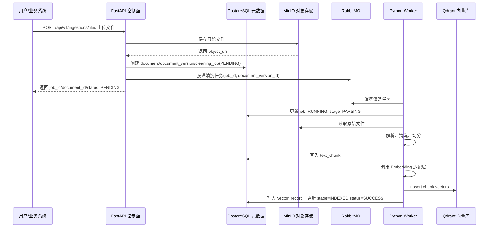
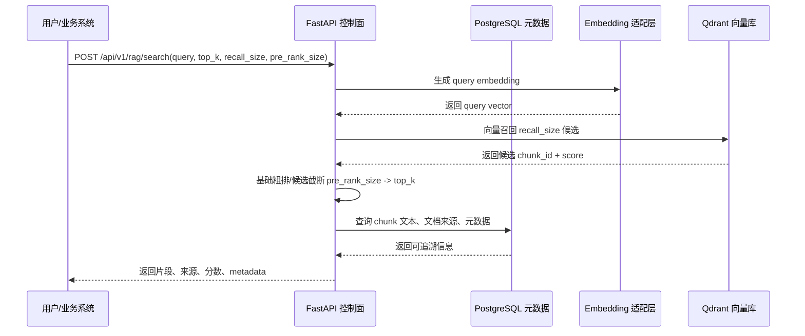

# 数据清洗与 RAG 服务 MVP 工程实施蓝图

## 目标

把 MVP 从“阶段计划”进一步拆成工程可执行蓝图。本文档用于指导下一步工程初始化、接口定义、数据模型设计和验收 Demo 准备。

MVP 闭环保持为：

```text
上传文档 -> 保存元数据 -> 异步清洗 -> 文本切分 -> Embedding -> 向量入库 -> 语义召回 -> 基础粗排/候选截断 -> 返回来源片段
```

## 默认落地假设

以下是推荐默认方案，若用户确认有组织约束，再调整：

| 类型 | 默认方案 | 说明 |
| --- | --- | --- |
| 控制面 | FastAPI | 负责 API、元数据、任务、状态、检索入口 |
| 清洗 Worker | Python Worker | 负责文档解析、清洗、切分、Embedding、向量写入 |
| 元数据库 | PostgreSQL | 存数据源、文档、任务、chunk、vector 记录 |
| 缓存 | Redis | 存热点配置、短状态、分布式锁或轻量缓存 |
| 消息队列 | RabbitMQ | MVP 任务队列，后续可替换 Kafka |
| 对象存储 | MinIO | 存原始文件和解析中间产物 |
| 向量库 | Qdrant | MVP 部署较轻，过滤能力清晰；也可替换 Milvus/pgvector |
| Embedding | 兼容适配层 | 线上通义 text-embedding，本地 BGE，mock 作为开发兜底 |

## 工程模块拆分

### api-service

职责：

- 文件上传入口。
- 文档和任务元数据写入。
- 清洗任务投递。
- 任务状态查询。
- 检索 API。
- 基础权限和参数校验。

核心包建议：

- `ingestion`：文件接入、数据源、文档版本。
- `job`：任务创建、状态机、重试入口。
- `search`：检索请求、向量召回结果合并、基础粗排/截断。
- `metadata`：文档、chunk、vector 记录查询。
- `infra`：对象存储、MQ、数据库、向量库客户端适配。

### worker-service

职责：

- 消费清洗任务。
- 拉取原始文件。
- 执行解析、清洗、切分。
- 调用 Embedding。
- 写入向量库。
- 回写任务状态。

核心模块建议：

- `consumers`：MQ 消费。
- `parsers`：PDF、Word、CSV 解析器插件。
- `cleaners`：编码标准化、空内容过滤、基础噪声过滤。
- `chunkers`：段落切分、长度切分、overlap 策略。
- `embeddings`：Embedding 适配层。
- `vectorstores`：Qdrant/Milvus/pgvector 适配层。

### infra

职责：

- 本地依赖编排。
- 初始化数据库。
- 初始化向量集合。
- 提供开发环境配置。

建议文件：

- `docker-compose.yml`
- `db/init.sql`
- `qdrant/init.md` 或集合初始化脚本
- `.env.example`

## MVP 数据模型

### data_source

| 字段 | 说明 |
| --- | --- |
| id | 数据源 ID |
| name | 数据源名称 |
| type | FILE / API / DB / STREAM / THIRD_PARTY |
| tenant_id | 租户 ID，MVP 可默认 default |
| status | ENABLED / DISABLED |
| created_at | 创建时间 |
| updated_at | 更新时间 |

### document

| 字段 | 说明 |
| --- | --- |
| id | 文档 ID |
| source_id | 数据源 ID |
| title | 文档标题 |
| content_type | 文件类型 |
| tenant_id | 租户 ID |
| current_version_id | 当前版本 |
| status | ACTIVE / DELETED |
| created_at | 创建时间 |
| updated_at | 更新时间 |

### document_version

| 字段 | 说明 |
| --- | --- |
| id | 版本 ID |
| document_id | 文档 ID |
| version_no | 版本号 |
| object_uri | 原始文件存储地址 |
| checksum | 文件摘要 |
| parse_status | 解析状态 |
| clean_status | 清洗状态 |
| index_status | 索引状态 |
| created_at | 创建时间 |

### cleaning_job

| 字段 | 说明 |
| --- | --- |
| id | 任务 ID |
| document_version_id | 文档版本 ID |
| job_type | INGEST / REINDEX |
| status | PENDING / RUNNING / SUCCESS / FAILED |
| current_stage | UPLOADED / PARSING / CLEANING / CHUNKING / EMBEDDING / INDEXED |
| retry_count | 重试次数 |
| error_code | 错误码 |
| error_message | 错误信息 |
| started_at | 开始时间 |
| finished_at | 结束时间 |

### text_chunk

| 字段 | 说明 |
| --- | --- |
| id | chunk ID |
| document_id | 文档 ID |
| document_version_id | 文档版本 ID |
| chunk_no | 分块序号 |
| content | 文本内容 |
| metadata | 页码、章节、标题层级等 JSON 元数据 |
| token_count | token 或字符估算 |
| checksum | chunk 摘要 |
| status | ACTIVE / DELETED |

### vector_record

| 字段 | 说明 |
| --- | --- |
| id | 向量记录 ID |
| chunk_id | chunk ID |
| embedding_model | Embedding 模型名称 |
| vector_store | QDRANT / MILVUS / PGVECTOR |
| collection | 向量集合 |
| vector_id | 向量库内 ID |
| index_version | 索引版本 |
| status | ACTIVE / DELETED |

## API 契约草案

### 1. 文件上传并创建清洗任务

`POST /api/v1/ingestions/files`

请求：

```json
{
  "source_id": "default-file-source",
  "tenant_id": "default",
  "knowledge_base_id": "kb-default",
  "title": "员工手册.pdf",
  "file": "multipart-file"
}
```

响应：

```json
{
  "job_id": "job_001",
  "document_id": "doc_001",
  "document_version_id": "ver_001",
  "status": "PENDING"
}
```

### 2. 查询任务状态

`GET /api/v1/jobs/{job_id}`

响应：

```json
{
  "job_id": "job_001",
  "status": "RUNNING",
  "current_stage": "EMBEDDING",
  "retry_count": 0,
  "error_code": null,
  "error_message": null,
  "stage_cost_ms": 340
}
```

### 3. 语义检索

`POST /api/v1/rag/search`

请求：

```json
{
  "query": "员工请假流程是什么？",
  "tenant_id": "default",
  "knowledge_base_ids": ["kb-default"],
  "top_k": 10,
  "recall_size": 200,
  "pre_rank_size": 50
}
```

响应：

```json
{
  "query": "员工请假流程是什么？",
  "items": [
    {
      "chunk_id": "chunk_001",
      "document_id": "doc_001",
      "content": "员工请假需在系统中提交申请...",
      "score": 0.87,
      "pre_rank_score": 0.87,
      "source": "员工手册.pdf",
      "metadata": {
        "page": 4,
        "section": "请假制度"
      }
    }
  ]
}
```

## 状态机

```text
PENDING
-> RUNNING
-> SUCCESS

PENDING
-> RUNNING
-> FAILED
```

阶段状态：

```text
UPLOADED
-> PARSING
-> CLEANING
-> CHUNKING
-> EMBEDDING
-> INDEXING
-> INDEXED
```

失败状态：

```text
PARSE_FAILED
CLEAN_FAILED
CHUNK_FAILED
EMBED_FAILED
INDEX_FAILED
```

## 最小 MVP 时序图

### 文档上传与异步入库



### 语义检索与基础粗排



说明：

- 上传链路异步，上传接口只保证文件保存、元数据创建和任务投递成功。
- Worker 负责重任务，不阻塞 API 请求线程。
- 检索链路 MVP 只做语义召回和基础粗排/候选截断。
- MVP 不调用 Cross-Encoder 精排，不做 SimHash/MinHash 去重和 MMR/DPP 打散。

## MVP 任务拆分

### M1：工程初始化

任务：

- 创建 FastAPI 服务骨架。
- 创建 Worker 服务骨架。
- 创建 Docker Compose。
- 提供 `.env.example`。
- 打通 FastAPI 服务到 PostgreSQL、RabbitMQ、MinIO、Qdrant 的连接。

验收：

- 本地一条命令启动依赖。
- FastAPI 健康检查可访问。
- Worker 能启动并订阅队列。

### M2：元数据和状态机

任务：

- 创建 6 张 MVP 核心表。
- 实现 document、document_version、cleaning_job 写入。
- 实现任务状态流转。
- 实现错误码和失败记录。

验收：

- 上传前可初始化默认 data_source。
- 创建任务后能查询到文档、版本和 job。
- 失败时能记录错误阶段和原因。

### M3：文件接入

任务：

- 实现上传接口。
- 文件写入 MinIO 或本地兼容存储。
- 计算 checksum。
- 创建 document_version。
- 投递清洗任务。

验收：

- 上传 PDF/Word/CSV 样例后生成 job。
- 重复上传同文件能识别 checksum。

### M4：清洗 Worker

任务：

- 消费清洗任务。
- 实现 PDF、Word、CSV 至少 2 类解析。
- 输出统一文本结构。
- 做基础清洗：空内容过滤、编码标准化、重复空白处理。

验收：

- Worker 能把样例文档解析为文本。
- 解析失败能进入 `PARSE_FAILED`。

### M5：切分与向量入库

任务：

- 实现按段落和长度的 chunk 策略。
- 生成 chunk 元数据。
- 调用统一 Embedding 适配层。
- 支持 `dashscope`、`local_bge`、`mock` 三类 provider。
- 线上通过 `DASHSCOPE_API_KEY` 调用通义 text-embedding。
- 本地通过 `EMBEDDING_BASE_URL` 调用 BGE 服务。
- 通过 `EMBEDDING_MODEL`、`EMBEDDING_DIMENSION` 控制模型名称和向量维度。
- 写入 Qdrant。
- 写入 text_chunk 和 vector_record。

验收：

- 文档处理后有 chunk 和向量记录。
- 能通过通义 text-embedding 或本地 BGE 生成真实向量。
- Qdrant 可以按向量召回 chunk。

### M6：语义检索与基础粗排

任务：

- 实现检索 API。
- Query 调用 Embedding。
- 向量库召回 `recall_size` 候选。
- 用向量相似度或融合分数做基础粗排。
- 截断到 `pre_rank_size` 和 `top_k`。
- 返回可追溯结果。

验收：

- 查询能返回目标片段。
- 响应包含 document_id、chunk_id、source、score、metadata。
- `recall_size`、`pre_rank_size`、`top_k` 可配置。
- MVP 不调用 Cross-Encoder 精排。

### M7：Demo 验收

任务：

- 准备 3 份样例文档。
- 准备 5 到 10 个测试问题。
- 编写 Demo 操作步骤。
- 记录成功率和失败样例。

验收：

- 可以完整演示上传、处理、检索。
- 失败样例有明确原因和后续优化项。

## 验收顺序

1. 基础设施启动。
2. API 服务和 Worker 健康检查。
3. 上传文件生成任务。
4. Worker 消费任务并解析文本。
5. chunk 入库。
6. 向量写入。
7. 检索返回片段。
8. 查看来源追溯。

## 后续进入第二阶段的条件

满足以下条件后，再进入混合检索和完整排序漏斗：

- MVP 文件接入链路稳定。
- 至少 3 类文档样例可以被解析和检索。
- 检索响应可追溯。
- 候选规模控制生效。
- 基础观测能看到任务耗时、失败阶段和检索耗时。

第二阶段才加入：

- 关键词检索。
- 混合召回。
- SimHash/MinHash 去重。
- MMR/DPP 打散。
- Cross-Encoder 精排。
- 索引重建和更完整的数据治理。

## 当前待确认

1. 默认方案调整为：FastAPI 控制面 + Python Worker。
2. 向量库是否使用 Qdrant 作为 MVP 默认实现。
3. 本地开发是否允许 Docker Compose。
4. Embedding 已确定采用兼容适配层：线上通义 text-embedding，本地 BGE；仍需确认线上密钥和本地 BGE 服务地址。
5. MVP 首批解析格式是否定为 PDF、Word、CSV。
