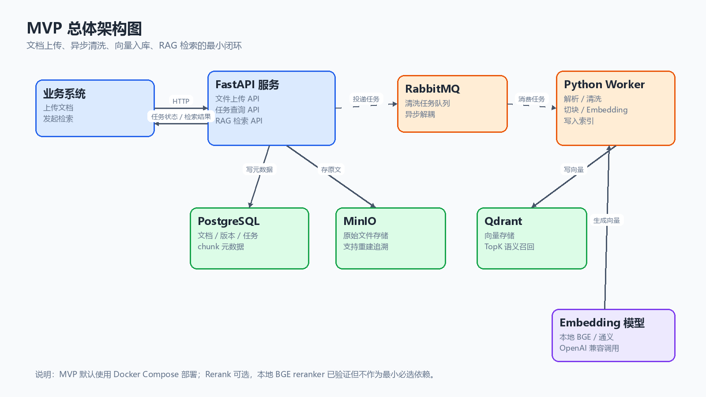
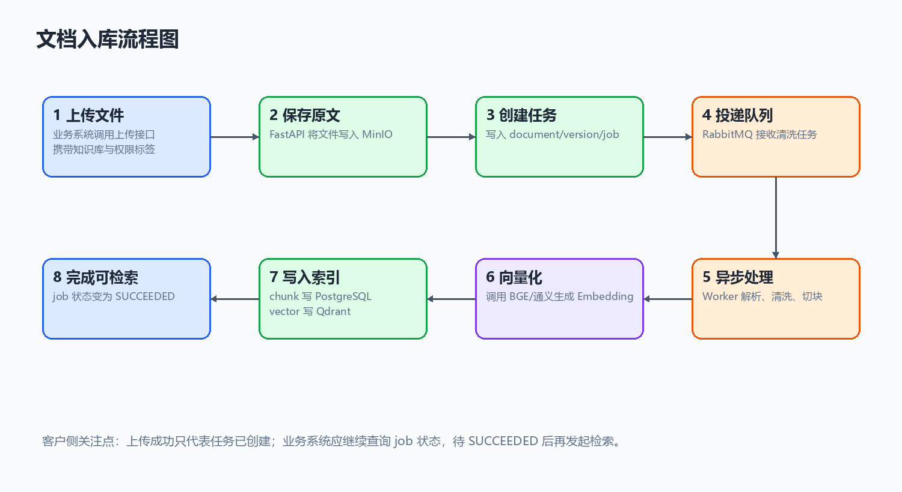
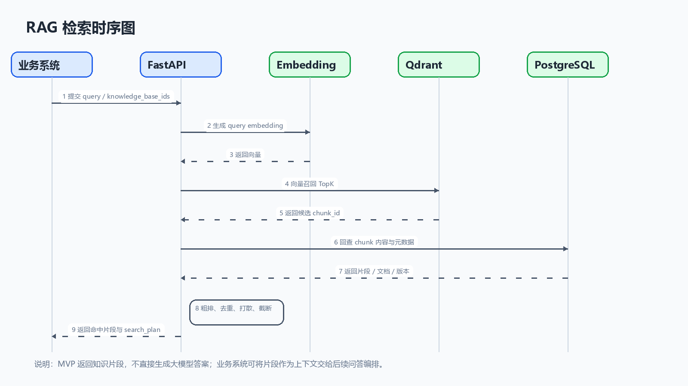

# 数据清洗与 RAG 服务 MVP 技术方案建议书

> **文档版本**：V1.0  
> **编制日期**：2026-05-16  
> **适用范围**：MVP 对客交流、接口联调说明、演示验收说明  
> **接口前缀**：`{BASE_URL}`，实际地址以部署环境为准  

---

## 1. 修订记录

| 版本号 | 修订日期 | 修订内容 | 修订人 |
| :--- | :--- | :--- | :--- |
| V1.0 | 2026-05-16 | 输出 MVP 技术方案与核心接口清单 | 项目组 |

---

## 2. 项目背景与目标

### 2.1 业务背景

客户侧通常沉淀了大量制度文档、操作手册、知识库文章、CSV 数据和 PDF 资料。传统关键词检索难以理解自然语言问题，也难以把文档内容加工成可被大模型稳定引用的知识片段。

本 MVP 版本聚焦先跑通“文档接入 -> 清洗切块 -> 向量化入库 -> RAG 检索”的最小闭环，验证技术链路、接口契约和基础检索效果，为后续业务系统接入、混合检索、重排、权限治理和生产监控打基础。

### 2.2 MVP 建设目标

1. 支持通过 API 上传文档，并异步完成清洗、解析、切块和向量化。
2. 支持基于知识库 ID 的检索隔离，避免不同知识库结果混杂。
3. 支持语义检索、关键词检索和混合检索的基础接口形态。
4. 支持返回命中的知识片段、文档 ID、版本 ID、知识库 ID 和排序信息。
5. 支持任务状态查询，便于业务系统跟踪文档入库进度。
6. 支持本地 BGE Embedding 验证，后续可切换线上通义 Embedding。

---

## 3. 总体架构设计

### 3.1 架构全景图

下图展示 MVP 的最小闭环架构。对客交流时建议先用这张图说明“谁负责接入、谁负责异步处理、数据分别存在哪里、模型在哪里调用”。



图 1：MVP 总体架构图

### 3.2 MVP 架构分层说明

| 层级 | 组件 | MVP 职责 |
| :--- | :--- | :--- |
| 接入层 | FastAPI | 对外提供文件上传、任务查询、RAG 检索等 HTTP API |
| 异步处理层 | RabbitMQ + Python Worker | 承接清洗任务，异步解析文档、清洗文本、切分 chunk、调用 Embedding |
| 数据存储层 | PostgreSQL | 保存文档、版本、任务、文本块、向量记录等元数据 |
| 对象存储层 | MinIO | 保存上传的原始文件 |
| 向量检索层 | Qdrant | 保存文本片段向量，并支持 TopK 语义召回 |
| 模型层 | 本地 BGE / 通义 Embedding | 文本向量化。MVP 已验证本地 BGE，线上可切换通义 |

### 3.3 MVP 能力边界

| 类型 | MVP 是否包含 | 说明 |
| :--- | :--- | :--- |
| 文件上传入库 | 包含 | 支持 txt、md、csv、pdf 基础解析 |
| 异步清洗任务 | 包含 | 上传后通过 RabbitMQ 交给 Worker 处理 |
| 文本切块 | 包含 | 按段落和长度生成 chunk |
| Embedding | 包含 | 支持 mock、本地 BGE、通义兼容适配 |
| 向量检索 | 包含 | 基于 Qdrant 召回相关 chunk |
| 知识库过滤 | 包含 | 支持 `knowledge_base_ids` 过滤 |
| 权限标签过滤 | 最小支持 | 支持 `permission_tags` 和 `permission_context` 标签交集过滤 |
| 重排 Rerank | 可选验证 | 本地 BGE reranker 已验证，但不作为 MVP 必选依赖 |
| 批量治理 | 不包含 | 作为后续生产可控性增强 |
| 完整鉴权 | 不包含 | 后续由网关或业务系统注入用户身份与权限上下文 |

---

## 4. 核心业务流程

### 4.1 文档入库流程



图 2：文档入库流程图

1. 业务系统调用文件上传接口，提交文件、租户 ID、知识库 ID 和权限标签。
2. FastAPI 将原始文件写入 MinIO。
3. FastAPI 在 PostgreSQL 中创建 document、document_version 和 cleaning_job 记录。
4. FastAPI 向 RabbitMQ 投递清洗任务。
5. Python Worker 消费任务，从 MinIO 下载原始文件。
6. Worker 解析文件内容，执行基础清洗和文本切块。
7. Worker 调用 Embedding 模型生成向量。
8. Worker 将向量写入 Qdrant，并将 chunk 元数据写回 PostgreSQL。
9. Worker 更新 cleaning_job 状态为 `SUCCEEDED` 或 `FAILED`。

### 4.2 RAG 检索流程



图 3：RAG 检索时序图

1. 业务系统调用 RAG 检索接口，提交自然语言问题。
2. FastAPI 根据查询文本生成 query embedding。
3. 系统在 Qdrant 中按租户、知识库和权限上下文过滤并召回候选 chunk。
4. 如启用关键词或混合检索，系统同时从 PostgreSQL 全文索引召回候选。
5. 系统执行候选合并、去重、同文档限额和结果截断。
6. 系统返回命中的知识片段、来源文档、版本 ID、知识库 ID、分数和检索计划。

---

## 5. 技术选型与核心优势

### 5.1 MVP 技术栈

| 类别 | 选型 | 说明 |
| :--- | :--- | :--- |
| API 框架 | FastAPI | Python 生态成熟，适合 AI 服务与模型适配 |
| 异步任务 | RabbitMQ | 解耦上传请求与耗时清洗流程 |
| Worker | Python Worker | 负责文档解析、清洗、切块、Embedding 和向量入库 |
| 元数据存储 | PostgreSQL | 保存文档、版本、任务、chunk 和检索辅助数据 |
| 对象存储 | MinIO | 保存原始文件，便于重建索引和问题追溯 |
| 向量数据库 | Qdrant | 支持向量检索和 payload 过滤 |
| Embedding | 本地 BGE / 通义 | 本地可用 BGE 验证，线上可切换通义 |
| 部署方式 | Docker Compose | 便于 MVP 快速部署、演示和交付验证 |

### 5.2 核心优势

1. **主链路闭环清晰**：上传、清洗、切块、向量化、检索均已形成可运行闭环。
2. **异步处理可靠**：文档上传不阻塞长时间清洗流程，业务系统可通过 job 查询进度。
3. **模型可兼容切换**：Embedding provider 支持 mock、本地 BGE 和通义。
4. **候选规模可控**：检索接口提供 `recall_size`、`pre_rank_size`、`top_k`，避免候选集无限放大。
5. **结果可追溯**：返回 chunk、document、document_version 和 metadata，便于业务端展示来源。

---

## 6. MVP 接口清单

### 6.1 接口总览

| 序号 | 接口 | 方法 | 用途 | MVP 必选 |
| :--- | :--- | :--- | :--- | :--- |
| 1 | `/health` | GET | 健康检查 | 是 |
| 2 | `/api/v1/ingestions/files` | POST | 上传文件并创建清洗任务 | 是 |
| 3 | `/api/v1/jobs/{job_id}` | GET | 查询清洗任务状态 | 是 |
| 4 | `/api/v1/rag/search` | POST | 执行 RAG 检索 | 是 |

---

## 7. MVP 接口说明

### 7.1 健康检查

**接口地址**

`GET {BASE_URL}/health`

**功能说明**

用于确认 API 服务是否正常启动。

**响应示例**

```json
{
  "status": "ok",
  "service": "rag-cleaning-api"
}
```

---

### 7.2 文件上传入库

**接口地址**

`POST {BASE_URL}/api/v1/ingestions/files`

**功能说明**

上传单个文件，系统创建文档、文档版本和清洗任务，并异步投递给 Worker 处理。

**Query 参数**

| 参数 | 类型 | 必填 | 默认值 | 说明 |
| :--- | :--- | :--- | :--- | :--- |
| `source_id` | string | 否 | `default-file-source` | 数据源 ID |
| `tenant_id` | string | 否 | `default` | 租户 ID |
| `knowledge_base_id` | string | 否 | `kb-default` | 知识库 ID，用于检索过滤 |
| `permission_tags` | string | 否 | `public` | 权限标签，多个值用英文逗号分隔 |

**Form 参数**

| 参数 | 类型 | 必填 | 说明 |
| :--- | :--- | :--- | :--- |
| `file` | file | 是 | 上传文件。MVP 已验证 txt、md、csv、pdf 基础解析 |

**响应字段**

| 字段 | 类型 | 说明 |
| :--- | :--- | :--- |
| `job_id` | string | 清洗任务 ID |
| `document_id` | string | 文档 ID |
| `document_version_id` | string | 文档版本 ID |
| `source_id` | string | 数据源 ID |
| `knowledge_base_id` | string | 知识库 ID |
| `permission_tags` | array[string] | 权限标签 |
| `filename` | string | 文件名 |
| `status` | string | 初始状态，通常为 `PENDING` |

**响应示例**

```json
{
  "job_id": "08131054-4022-438d-9440-7ddfcc375fc1",
  "document_id": "70fef73a-2f6c-4d2b-a192-89da5e5f933b",
  "document_version_id": "cc44d077-07c0-4922-ab66-47e1a891fe1a",
  "source_id": "default-file-source",
  "knowledge_base_id": "kb-default",
  "permission_tags": ["public"],
  "filename": "smoke.txt",
  "status": "PENDING"
}
```

**调用示例**

```powershell
curl.exe -s -X POST "{BASE_URL}/api/v1/ingestions/files?source_id=default-file-source&tenant_id=default&knowledge_base_id=kb-default&permission_tags=public" -F "file=@samples/documents/smoke.txt"
```

---

### 7.3 查询清洗任务

**接口地址**

`GET {BASE_URL}/api/v1/jobs/{job_id}`

**功能说明**

查询文档清洗任务状态。业务系统可轮询该接口，判断文件是否已经完成入库并可被检索。

**Path 参数**

| 参数 | 类型 | 必填 | 说明 |
| :--- | :--- | :--- | :--- |
| `job_id` | string | 是 | 文件上传接口返回的任务 ID |

**响应字段**

| 字段 | 类型 | 说明 |
| :--- | :--- | :--- |
| `job_id` | string | 清洗任务 ID |
| `document_version_id` | string | 文档版本 ID |
| `tenant_id` | string | 租户 ID |
| `status` | string | `PENDING`、`RUNNING`、`RETRYING`、`FAILED`、`SUCCEEDED` |
| `retry_count` | number | 自动重试次数 |
| `retry_of_job_id` | string/null | 如为人工重试任务，记录来源 job |
| `error_message` | string/null | 失败原因 |
| `started_at` | string/null | 开始时间 |
| `finished_at` | string/null | 完成时间 |
| `created_at` | string | 创建时间 |
| `updated_at` | string | 更新时间 |

**响应示例**

```json
{
  "job_id": "08131054-4022-438d-9440-7ddfcc375fc1",
  "document_version_id": "cc44d077-07c0-4922-ab66-47e1a891fe1a",
  "tenant_id": "default",
  "status": "SUCCEEDED",
  "retry_count": 0,
  "retry_of_job_id": null,
  "error_message": null,
  "started_at": "2026-05-16T11:00:00.000000+00:00",
  "finished_at": "2026-05-16T11:00:04.000000+00:00",
  "created_at": "2026-05-16T11:00:00.000000+00:00",
  "updated_at": "2026-05-16T11:00:04.000000+00:00"
}
```

---

### 7.4 RAG 检索

**接口地址**

`POST {BASE_URL}/api/v1/rag/search`

**功能说明**

根据用户问题检索相关知识片段。接口支持按租户、知识库和权限标签过滤，返回命中的 chunk 及检索计划信息。

**请求字段**

| 字段 | 类型 | 必填 | 默认值 | 说明 |
| :--- | :--- | :--- | :--- | :--- |
| `query` | string | 是 | 无 | 用户问题 |
| `tenant_id` | string | 否 | `default` | 租户 ID |
| `knowledge_base_ids` | array[string] | 否 | `["kb-default"]` | 知识库过滤 |
| `permission_context` | array[string] | 否 | `["public"]` | 当前请求具备的权限标签 |
| `search_mode` | string | 否 | `hybrid` | `semantic`、`keyword`、`hybrid` |
| `top_k` | number | 否 | `10` | 最终返回条数 |
| `recall_size` | number | 否 | `200` | 初始召回候选数 |
| `pre_rank_size` | number | 否 | `50` | 粗排后保留候选数 |
| `dedup_enabled` | boolean | 否 | `true` | 是否启用内容去重 |
| `diversity_enabled` | boolean | 否 | `true` | 是否启用简化打散 |
| `max_chunks_per_document` | number | 否 | `2` | 同一文档版本最多返回 chunk 数 |
| `rerank_enabled` | boolean | 否 | `false` | 是否启用重排 |
| `rerank_size` | number | 否 | `50` | 最多进入重排的候选数 |

**请求示例**

```json
{
  "query": "语义检索如何控制候选集规模？",
  "tenant_id": "default",
  "knowledge_base_ids": ["kb-default"],
  "permission_context": ["public"],
  "search_mode": "hybrid",
  "top_k": 5,
  "recall_size": 30,
  "pre_rank_size": 10,
  "dedup_enabled": true,
  "diversity_enabled": true,
  "max_chunks_per_document": 2,
  "rerank_enabled": false,
  "rerank_size": 5
}
```

**响应字段**

| 字段 | 类型 | 说明 |
| :--- | :--- | :--- |
| `query` | string | 原始查询 |
| `items` | array | 命中的知识片段列表 |
| `items[].chunk_id` | string | 文本片段 ID |
| `items[].score` | number | 当前排序分 |
| `items[].recall_sources` | array[string] | 召回来源，如 `semantic`、`keyword` |
| `items[].semantic_score` | number/null | 语义召回分 |
| `items[].keyword_score` | number/null | 关键词召回分 |
| `items[].pre_rank_score` | number | 粗排分 |
| `items[].rerank_score` | number/null | 重排分，未启用或降级时为空 |
| `items[].content` | string | 命中的知识片段内容 |
| `items[].document_id` | string | 文档 ID |
| `items[].document_version_id` | string | 文档版本 ID |
| `items[].knowledge_base_id` | string | 知识库 ID |
| `items[].permission_tags` | array[string] | 片段权限标签 |
| `items[].chunk_index` | number | 片段序号 |
| `items[].metadata` | object | 文件名、解析器等元数据 |
| `search_plan` | object | 本次检索计划和候选统计 |

**响应示例**

```json
{
  "query": "语义检索如何控制候选集规模？",
  "items": [
    {
      "chunk_id": "c23f3c58-92cb-5f45-9983-7d6d1cf6cc30",
      "score": 0.8123,
      "recall_sources": ["semantic"],
      "semantic_score": 0.8123,
      "keyword_score": null,
      "pre_rank_score": 0.8123,
      "rerank_score": null,
      "content": "检索请求通过 recall_size、pre_rank_size 和 top_k 控制候选集规模。",
      "document_id": "59da62d8-8ff6-4ef5-8055-b08f46f253b1",
      "document_version_id": "8e3da0b2-b7c9-4d03-83f1-620c6db6d355",
      "knowledge_base_id": "kb-default",
      "permission_tags": ["public"],
      "chunk_index": 2,
      "metadata": {
        "parser": "plain_text",
        "filename": "retrieval-funnel-boundary.md"
      }
    }
  ],
  "search_plan": {
    "search_mode": "hybrid",
    "recall_size": 30,
    "pre_rank_size": 10,
    "top_k": 5,
    "rerank_enabled": false,
    "rerank_degraded": false
  }
}
```

---

## 8. 统一错误响应

所有业务错误、参数校验错误和未捕获异常统一返回以下结构：

```json
{
  "error": {
    "code": "ERROR_CODE",
    "message": "Human readable message"
  }
}
```

### MVP 常见错误码

| code | HTTP 状态 | 场景 |
| :--- | :--- | :--- |
| `JOB_NOT_FOUND` | 404 | 查询不存在的任务 |
| `EMPTY_FILE` | 400 | 上传文件为空 |
| `VALIDATION_ERROR` | 422 | 请求参数类型或结构不合法 |
| `INTERNAL_ERROR` | 500 | 依赖服务异常或未捕获异常 |

---

## 9. 部署与实施规划

### 9.1 MVP 部署方式

MVP 推荐使用 Docker Compose 部署，包含：

1. FastAPI API 服务
2. Python Worker 服务
3. PostgreSQL
4. RabbitMQ
5. MinIO
6. Qdrant
7. 可选本地 BGE Embedding 服务
8. 可选本地 BGE Rerank 服务

### 9.2 模型配置建议

| 环境 | Embedding 配置 | Rerank 配置 | 说明 |
| :--- | :--- | :--- | :--- |
| 本地演示 | 本地 BGE `bge-m3` | 可选本地 BGE reranker | 数据不出本机，便于演示 |
| 开发联调 | mock 或本地 BGE | mock | 速度快、依赖少 |
| 生产候选 | 通义 `text-embedding` 或本地 BGE | 根据评测结果选择 | 需要结合效果、成本、延迟评估 |

---

## 10. MVP 验收方式

| 验收项 | 验收方式 | 预期结果 |
| :--- | :--- | :--- |
| API 健康检查 | 调用 `/health` | 返回 `status=ok` |
| 文档上传 | 调用 `/api/v1/ingestions/files` | 返回 job、document、version ID |
| 任务完成 | 轮询 `/api/v1/jobs/{job_id}` | 状态最终为 `SUCCEEDED` |
| RAG 检索 | 调用 `/api/v1/rag/search` | 返回相关知识片段 |
| 知识库过滤 | 使用错误知识库 ID 检索 | 不返回其他知识库结果 |
| 异常处理 | 上传空文件或非法参数 | 返回统一错误结构 |

已沉淀自动化脚本：

```powershell
.\scripts\smoke-test.ps1
.\scripts\demo-eval.ps1
.\scripts\failure-test.ps1
```

---

## 11. 后续扩展方向

MVP 完成后，建议按以下顺序推进：

1. 混合检索增强：语义召回 + 关键词召回 + RRF 融合。
2. 业务干预：去重、打散、同文档限额、质量过滤。
3. 本地或线上 Rerank：只对少量高质量候选做精排。
4. 文档生命周期：删除、更新、重建、审计。
5. 生产可控性：并发锁、失败补偿、诊断指标、批量治理。
6. 对接真实鉴权：由业务网关或统一身份系统注入用户权限上下文。

---

## 12. 术语表

| 术语 | 解释 |
| :--- | :--- |
| RAG | 检索增强生成，通过外部知识片段增强大模型回答能力 |
| Embedding | 将文本转换为向量表示的模型能力 |
| Chunk | 文档切分后的文本片段，是检索和引用的基本单位 |
| Vector DB | 向量数据库，用于存储和检索高维向量 |
| Rerank | 对召回候选进行精排，提高最终结果相关性 |
| Knowledge Base | 知识库，用于区分不同业务域或资料集合 |

---

## 13. 文档自检

- 已使用对客可理解的模块说明。
- 已避免暴露本地 IP、内部端口和敏感配置。
- 已明确 MVP 包含范围和后续扩展边界。
- 已提供核心接口清单、参数、响应和示例。
